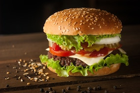
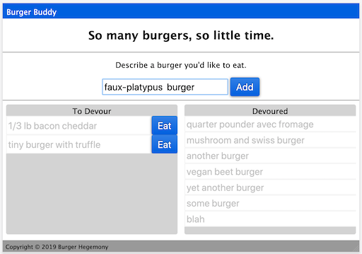

# utbc2019-hw-14-burger


##### Image courtesy Ilya Mashkov, Unsplash.com

## Your personal burger consumption manager has arrived.



### Value Proposition

Are you a burger-lover?
Does the scale of that devotion require some burger-consumption management?

This entirely silly application will do that.

* It allows you to create a description of a burger you'd like to eat.
* Add that burger to a list.
* Move the burger to the 'Devoured' list at the press of a button.

Burger lists are persisted through a mysql database on a server.

## The (Real) Value Proposition: Dev Fu

This simple, fullstack web application illustrates several classic web development technologies:

* Object Relational Mapping (ORM)
    
    Put an object-based front-end on your relational database queries.

* Server-side HTML generation with templates
    
    Use handlebars syntax and middleware to render scalable HTML within your Node express server.

* Mode View Controller (MVC) software pattern
    
    Organize server-side components in this classic form that facilitates development and maintenance through a separation of concerns.

## Technology Stack

* Frontend
	* HTML, CSS (flex box)
	* AJAX-based javascript controller
		* Fetch, Promises
* Backend
	* Node.js / Express.js server
	* Persisted data via ORM-wrapped mysql database
	* Middleware
		* json body parsing
		* Handlebars templates and HTML rendering
	* Model View Controller decomposition
		* model = database and related interface
		* view = html templates
		* controller = server side routes
	* RESTful API

## Developer's Journal

I come from a configuration management background (think 'the factory that makes the software').  So I deeply appreciate directory structures and file naming.

With this project the directory structure looks like this:

```
	./server.js

	./models/burger.js
	./models/db/orm.js
	./models/db/config/connection.js
	./models/db/schema.sql
	./models/db/seeds.sql

	./views/index.handlebars
	./views/layouts/main.handlebars

	./controllers/burgerController.js

	./public/assets/js/controller.js
	./public/assets/css/style.css
```

The server.js is self-explanatory ... it's our Node.js server that runs on some mystical server in the cloud (or possibly on localhost when we're in development mode.)

The stuff under ./models relates to persisted data which drives the application.  In this case, it's our burger records stored in a mysql database and wrappered by a nice javascript-friendly object relational mapping (orm).  The schema for that data looks like this:

```
CREATE DATABASE burger_db;
USE burger_db;

CREATE TABLE burgers(
    id INTEGER AUTO_INCREMENT NOT NULL,
    burger VARCHAR(255) NOT NULL,
    devoured BOOLEAN NOT NULL,
    PRIMARY KEY(id)
);
```

The files under ./views are the handlebars templates used to generate the on-the-fly HTML pushed to the client from the server.  Basically, you hydrate templates into full HTML by adding JSON and calling res.render().

The file under ./controllers is the server-side routing that implements our RESTful API that responds to client requests to fetch our lists, add a new burger, and devour a specific burger.

Under full disclosure, the controller concept also applies to some client-side code as well:

```
public/assets/js/controller.js
```

This code registers click handlers and makes dynamic requests to the backend as users add and devour burgers.  Key features include calls to 'fetch' for asynchronous processing by the express server in response to user input.

Finally, most of the nice styling applied to our dynamically generated HTML is embodied in a single cascading style sheet (CSS):

```
public/assets/css/style.css
```

It's the reason the user interface doesn't look like this:

